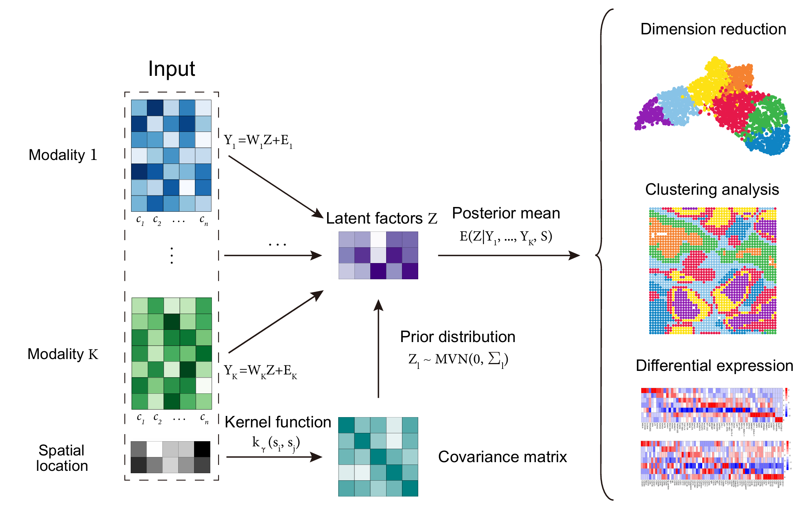

# Spatial Multi-Omics PCA

Spatial Multi-Omics PCA (SMOPCA) is a novel dimension reduction method to integrate multi-modal data and extract low-dimensional representations with preserved spatial dependencies among spots.




## Quick Installation

```bash
# Install with GPU acceleration (default)
uv add git+https://github.com/imessien/SMOPCA.git

# Install with CUDA 12 support
uv add git+https://github.com/imessien/SMOPCA.git[gpu-cuda12]
```

## Quick Start

```python
from src.model import SMOPCA
import numpy as np

# Create sample data
n_cells = 100
pos = np.random.rand(n_cells, 2) * 10
Y_rna = np.random.poisson(5, (200, n_cells)).astype(np.float32)
Y_adt = np.random.poisson(10, (50, n_cells)).astype(np.float32)
Y_list = [Y_rna, Y_adt]

# GPU-accelerated SMOPCA
model = SMOPCA(Y_list=Y_list, pos=pos, Z_dim=15, use_gpu=True)
model.buildKernel(method='scipy', length_scale=1.0)
model.estimateParams(
    iterations_gamma=10,
    iterations_sigma_W=20,
    sigma_init_list=(1.0, 1.0),
    sigma_xtol_list=(1e-5, 1e-5)
)
embeddings = model.calculatePosterior()
```

## imzML Data Processing

```python
from src.utils import load_imzml_data, preprocess_imzml_data

# Load imzML data
adata = load_imzml_data("path/to/your/file.imzML", mz_range=(100, 1000))
adata_processed = preprocess_imzml_data(adata, min_pixels=10)

# Convert to SMOPCA format and run
pos = adata_processed.obsm['spatial']
Y_list = [adata_processed.X.T]
model = SMOPCA(Y_list=Y_list, pos=pos, Z_dim=15, use_gpu=True)
# ... rest of workflow
```

## Workflow

1. Prepare input data
   - SMOPCA accepts gene expression and protein/atac data matrices. Each modality of the data is preprocessed and normalized  separately. Initially, genes and proteins with zero counts were filtered out. Subsequently, the count matrix was normalized based on library size, followed by log-transformation and scaling to achieve unit variance and zero mean. ATAC reads are mapped to gene regions and the peak matrix is collapsed into a gene activity matrix, adhering to the established protocol from the Satija lab. The gene activity matrix was preprocessed and normalized using the same method as applied to mRNA data. Finally, we recommend to save the data into a hdf5 file.
   - Note that SMOPCA takes input matrices with columns corresponding to cells or spots.
2. Specify model hyperparameters and Model training
   - the dimensionality of the latent factors (default 20)
   - the kernel type (default matern kernel)
   - For the rest of the parameters, see more in tutorials.
3. Downstream analysis
   - Visualization
   - Clustering analysis
   - Differential expression analysis
   - GSEA
   - Other tasks

## Datasets

Sample datasets are provided in `./data` folder. The rest of the datasets used in this study are available at https://doi.org/10.5281/zenodo.15187362

